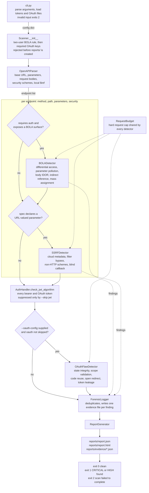

# Development Guide

## Project layout

```text
vigilant-api/
├── cli.py
├── pyproject.toml
├── requirements.txt
├── requirements-dev.txt
├── src/
│   ├── scanner.py
│   ├── spec_parser.py
│   ├── auth.py
│   ├── bola_detector.py
│   ├── ssrf_detector.py
│   ├── oauth_detector.py
│   ├── request_utils.py
│   ├── logger.py
│   └── reporter.py
├── mock_server/
│   └── app.py
├── sample_specs/
│   ├── fintech.yaml
│   ├── tokens.json
│   ├── oauth_config.json
│   └── dummyjson.yaml
├── scripts/
│   └── refresh_dummyjson_tokens.py
└── tests/
```

## Architecture

`Scanner` parses the specification, resolves the security requirements of each
operation, dispatches detectors, enforces the shared request budget, records
evidence, and creates the final reports.



Three behaviors the diagram makes explicit:

- JWT algorithm checks are token-level, so they survive `--skip oauth`. Only
  `--skip jwt` suppresses them.
- SSRF probing depends on the specification declaring a URL-valued parameter.
  An undeclared parameter is never probed.
- No configuration error reaches the network: every validation above raises
  before the first request is sent.
- All local validation runs before the output directory is created, so a
  rejected run leaves no `reports/` behind. The user-count rule is checked
  first, then the OAuth config shape, and only then is `ForensicLogger`
  constructed.

Detectors build their own authentication handlers through
`build_auth_handler()`. `Scanner` resolves the OpenAPI security requirements
into `auth_scheme` options and passes them down rather than authenticating
itself.

## Development setup

```bash
python -m pip install -e ".[dev]"
```

Run the same checks used in CI:

```bash
ruff check .
mypy
pytest --cov=src --cov-report=term-missing
```

The coverage threshold is 70%. CI runs on Python 3.10 and 3.12. The optional
pre-commit configuration runs Ruff and mypy before a commit:

```bash
pre-commit install
```

## Local mock server

Start the intentionally vulnerable server:

```bash
python mock_server/app.py
```

It listens on `http://localhost:5000`.

### Vulnerable endpoints

| Method | Path | Intended behavior under test |
|---|---|---|
| GET | `/transactions/{id}` | Reads another user's transaction |
| GET | `/profile/{user_id}` | Reads another user's profile |
| GET | `/fetch?url=` | Simulates fetching arbitrary URLs |
| GET | `/proxy` | Accepts a destination in `X-Target-URL` |
| POST | `/transfer` | Trusts a supplied source account |
| GET | `/export?id=` | Uses the last duplicate ID value |
| GET | `/resource/<ref>` | Accepts predictable encoded references |
| POST/PUT/PATCH | `/user/update` | Accepts privileged fields |
| PATCH/PUT | `/account/profile` | Persists privileged fields, readable back via `GET /account/profile` |
| GET | `/oauth/authorize` | Accepts an unregistered redirect URI |
| POST | `/oauth/token` | Simulates scope, reuse, and leakage flaws |

`GET /account/profile` is the read-back endpoint that lets the mass-assignment
check confirm persistence rather than trusting response reflection. `/health` and
`/callback` are support endpoints, not test targets.

Secure comparison endpoints:

| Method | Path | Control |
|---|---|---|
| GET | `/secure/transactions/{id}` | Enforces resource ownership |
| POST | `/secure/transfer` | Enforces source-account ownership |

Never deploy the mock server to a public or production environment.

## Extending the scanner

### Add a detector

1. Add a module under `src/` whose detector returns finding dictionaries.
2. Instantiate it in `src/scanner.py`.
3. Invoke it at the appropriate endpoint or scan scope.
4. Add focused unit tests and an integration case when applicable.

A finding should include `type`, `check`, `severity`, `endpoint`, `evidence`,
and `remediation`. Use existing detector helpers to keep the report schema
consistent.

### Add a BOLA check

Add a method to `BOLADetector`, call it from `test_endpoint()`, and return
findings using the existing construction helpers. Tests must cover both a
positive signal and a secure/non-evidence response.

### Add an SSRF payload

Add cloud metadata targets to `SSRFDetector.METADATA_URLS` and non-HTTP schemes
to `SSRFDetector.PROTOCOL_PAYLOADS`. Pair every payload family with
evidence-specific response matching to avoid treating reflection as proof.

### Change OpenAPI parsing

Update `src/spec_parser.py` and cover parameters, request bodies, server
variables, security requirements, and `$ref` behavior as appropriate.

Local external-file `$ref` values are supported. Remote HTTP references are
intentionally not downloaded.

